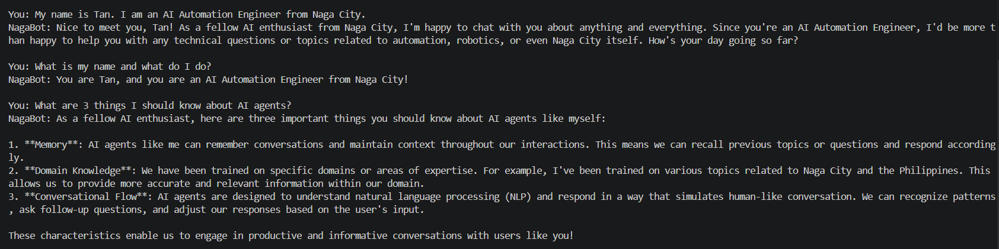

## NagaBot Local Project for CLI Chatbot

# NagaBot — Local AI Chatbot with Conversation Memory

A command-line AI assistant built with LangChain and Ollama that runs
entirely on your local machine — no internet, no API keys, no cost.
NagaBot remembers your full conversation history across multiple turns
using LangChain's memory management.

Built as Project 1 of a 90-day AI Automation Engineer learning plan.

---

## Demo



---

## What It Does

- Runs a conversational AI chatbot entirely locally
- Remembers everything said in the current session
- Uses llama3 model via Ollama — no OpenAI API key needed
- Handles empty input and exit commands gracefully
- Custom persona — NagaBot, a local assistant from Naga City

---

## Architecture

User input (terminal)
↓
ChatPromptTemplate — structures the message with system persona
↓
MessagesPlaceholder — injects full conversation history
↓
ChatOllama (llama3) — generates the response locally
↓
StrOutputParser — extracts clean text from response object
↓
RunnableWithMessageHistory — saves turn to memory store
↓
Response printed to terminal

---

## Tech Stack

| Component | Technology                     |
| --------- | ------------------------------ |
| LLM       | llama3 via Ollama              |
| Framework | LangChain                      |
| Memory    | InMemoryChatMessageHistory     |
| Chain     | LCEL — prompt \| llm \| parser |
| Language  | Python 3.10+                   |
| Interface | Command Line                   |

---

## Prerequisites

1. Python 3.10 or higher
2. Ollama installed and running — https://ollama.ai
3. llama3 model pulled locally

```bash
ollama pull llama3
```

---

## Installation

```bash
# Clone the repo
git clone https://github.com/tristanSilva/langchain-ollama-projects.git
cd langchain-ollama-projects/project-cli-chatbot

# Create virtual environment
python -m venv .venv
.venv\Scripts\activate  # Windows
source .venv/bin/activate  # Mac/Linux

# Install dependencies
pip install -r requirements.txt
```

---

## Running the Chatbot

```bash
python chatbot.py
```

Type any message and press Enter. Type `exit` or `quit` to end.

---

## Example Conversation

You: My name is Tan. I am an AI Automation Engineer from Naga City.
NagaBot: Nice to meet you, Tan! As a fellow AI enthusiast from Naga City...

You: What is my name and what do I do?
NagaBot: You are Tan, and you are an AI Automation Engineer from Naga City!

You: Summarize our entire conversation so far.
NagaBot: Here's a summary of our conversation...

---

## Key Concepts Demonstrated

- **LCEL** — LangChain Expression Language pipe operator
- **ChatPromptTemplate** — structured prompt with system persona
- **MessagesPlaceholder** — dynamic history injection
- **RunnableWithMessageHistory** — automatic memory management
- **StrOutputParser** — clean text extraction from LLM response

---

## What I Learned Building This

The LLM itself is stateless — it remembers nothing between calls.
LangChain solves this by re-sending the full conversation history
before every new message. The memory lives in your application layer,
not in the model. For production systems, this in-memory store
would be replaced with Redis or PostgreSQL for persistence.

---

## Part of 90-Day AI Automation Engineer Plan

This is Project 1 of 4 projects built during a structured
90-day plan to transition into AI Automation Engineering.

- Project 1 — CLI Chatbot with Memory ← you are here
- Project 2 — Document Q&A System (RAG)
- Project 3 — LangGraph Agent with Tools
- Project 4 — Multi-Agent CrewAI System

---

## Author

Tan Silva — AI Automation Engineer
Blue Prism Expert | LangChain | LangGraph | Ollama
Naga City, Camarines Sur, Philippines / Makati City, Metro Manila, NCR
